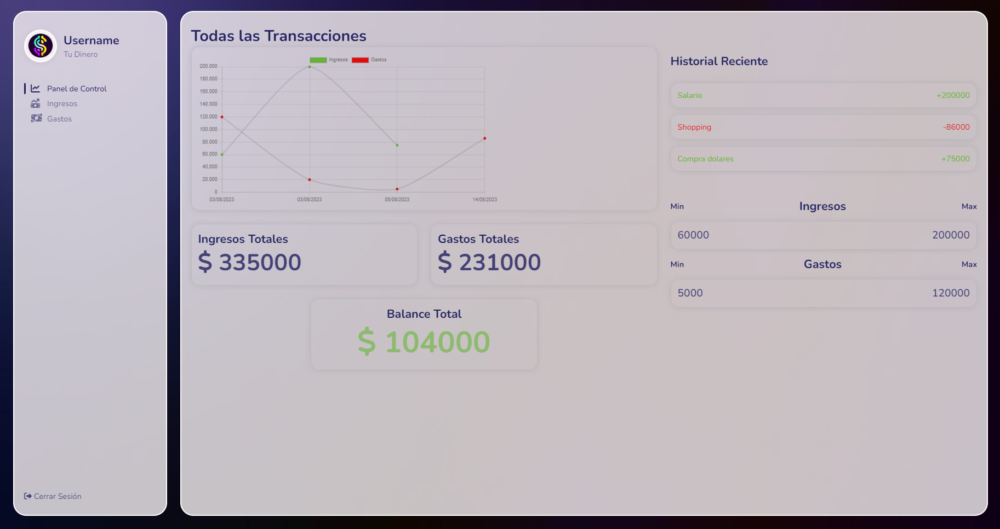

<h1 align="center">Gestor Financiero con React.js y Node.js</h1>

<p align="center">
  
</p>

<p align="center">
  
</p>

<p align="center">
  <strong>Una herramienta de gestión financiera</strong>
</p>

<p align="center">
  <a href="#características">Características</a> •
  <a href="#tecnologías">Tecnologías</a> •
  <a href="#instalación">Instalación</a> •
  <a href="#creación-de-un-clúster-en-mongodb">Creación de un Clúster en MongoDB</a> •
  <a href="#uso">Uso</a> •
  <a href="#nota">Nota</a> •
</p>

## Características

- **Seguimiento de Gastos:** Mantén un registro detallado de tus gastos para entender mejor tu flujo de efectivo.
- **Ganancias y Ingresos:** Registra tus fuentes de ingresos y mantén un equilibrio financiero saludable.
- **Visualizaciones Gráficas:** Visualiza tus datos financieros en gráficos claros y comprensibles.

## Tecnologías

- **Frontend:** React.js, HTML, CSS
- **Backend:** Node.js, Express
- **Base de Datos:** MongoDB

## Instalación

- **Clonar Repositorio**
- **Instalar Node.js:** Este proyecto requiere tener **Node.js** instalado. Node.js es un entorno de ejecución de JavaScript que te permite ejecutar scripts del lado del servidor y construir aplicaciones web escalables. Sigue los pasos a continuación para instalar **Node.js** en tu sistema:

<p align="center">
  <a href="#paso-1-comprobar-si-nodejs-ya-está-instalado">Paso 1</a> •
  <a href="#paso-2-instalar-nodejs">Paso 2</a> •
  <a href="#paso-3-verificar-la-instalación">Paso 3</a> •
</p>

## Paso 1: Comprobar si Node.js ya está instalado

Antes de instalar **Node.js**, es una buena idea verificar si ya está instalado en tu sistema. Abre tu terminal y ejecuta el siguiente comando:

```sh
node -v
```

Si obtienes una versión de Node.js como resultado (por ejemplo, v14.17.4), significa que Node.js ya está instalado y puedes omitir los siguientes pasos.

## Paso 2: Instalar Node.js

Si Node.js no está instalado en tu sistema, sigue estos pasos para instalarlo:

### Windows:

1. Visita el sitio oficial de Node.js en [https://nodejs.org/](https://nodejs.org/)
2. Descarga la versión **LTS** (Long Term Support) recomendada para la mayoría de los usuarios.
3. Ejecuta el archivo descargado y sigue las instrucciones del instalador.

### macOS:

1. Puedes instalar Node.js en macOS usando **Homebrew**, un gestor de paquetes de terceros. Si no tienes Homebrew, puedes instalarlo desde [https://brew.sh/index_es](https://brew.sh/index_es).
2. Abre tu terminal y ejecuta el siguiente comando para instalar Node.js:

```sh
brew install node
```

### Linux:

1. Abre tu terminal.
2. Ejecuta los siguientes comandos uno por uno para instalar **Node.js** usando `curl` y `npm`:

```sh
curl -fsSL https://deb.nodesource.com/setup_lts.x | sudo -E bash -
sudo apt-get install -y nodejs
```

## Paso 3: Verificar la instalación

Después de completar la instalación, verifica que **Node.js** y **npm** (el gestor de paquetes de **Node.js**) estén instalados correctamente. Ejecuta los siguientes comandos en tu terminal:

```sh
node -v
npm -v
```

Deberías ver las versiones de Node.js y npm impresas en la terminal.

¡Listo! Ahora tienes Node.js instalado en tu sistema y estás listo para trabajar en este proyecto.

## Creación de un Clúster en MongoDB

Un clúster en MongoDB es un conjunto de servidores interconectados que trabajan juntos para almacenar y gestionar los datos de tu aplicación. A continuación, se detallan los pasos básicos para crear un clúster en MongoDB utilizando MongoDB Atlas, el servicio de base de datos en la nube de MongoDB:

1. **Registro y Acceso a MongoDB Atlas:**

   - Ve al sitio web de [MongoDB Atlas](https://www.mongodb.com/cloud/atlas) y regístrate o inicia sesión en tu cuenta.
   - Crea un nuevo proyecto o selecciona uno existente.

2. **Creación de un Nuevo Clúster:**

   - En la página del proyecto, ve a "Database Clusters" (Clústeres de bases de datos) y haz clic en el botón "Build a Cluster" (Crear un clúster).
   - Selecciona la nube y la región donde deseas alojar tu clúster.

3. **Configuración del Clúster:**

   - Elige las opciones de configuración, como el proveedor de nube, la región, el tipo de máquina y el número de réplicas. Puedes empezar con una configuración básica y luego ajustarla según tus necesidades.

4. **Opciones Avanzadas (opcional):**

   - Puedes personalizar aún más la configuración del clúster, como habilitar la replicación multi-región o la habilitación de discos cifrados.

5. **Configuración de Acceso:**

   - Configura las reglas de acceso para permitir conexiones desde direcciones IP específicas o desde cualquier dirección (no recomendado para entornos de producción). También puedes configurar usuarios y contraseñas para el acceso a la base de datos.

6. **Crear el Clúster:**

   - Una vez configurado todo, haz clic en "Create Cluster" (Crear clúster) para iniciar el proceso de creación.

7. **Espera y Verificación:**

   - El proceso de creación del clúster puede llevar unos minutos. Una vez creado, podrás ver el estado del clúster en la página de MongoDB Atlas.

8. **Conexión a la Base de Datos:**
   - Desde la página del clúster, puedes obtener la cadena de conexión que necesitas para conectar tu aplicación a la base de datos MongoDB.

¡Listo! Has creado un clúster en MongoDB utilizando MongoDB Atlas. Recuerda que MongoDB Atlas proporciona una interfaz de usuario intuitiva para administrar y monitorizar tu clúster, además de herramientas para respaldos automáticos y escalado horizontal, entre otras características útiles.

## Uso

1. **Setear variables de entorno**

   - Tanto en la carpeta backend, como en la carpeta frontend, hay un archivo .env-template el cual debe renombrar (En el caso de backend por .env y en el caso de frontend por .env.local). Para el .env de backend debe setear la variable MONGO_URL por la de la url provista por tu cluster de MongoDB.

2. **Instalar dependencias**

   - En ambas carpetas (/backend y /frontend) ejecutar:

   ```sh
   npm install
   ```

   para instalar las dependencias presentes en el archivo **package.json** de cada carpeta

3. **Levantar servidor (backend)**

   - Abrir una nueva terminal y posicionarse en **/backend** y ejecutar:

   ```sh
   npm run start
   ```

   esperar que en la terminal se divise
   **Listening to port: 5000**
   **DB Connected**

4. **Levantar web (frontend)**

   - Abrir una nueva terminal y posicionarse en **/frontend** y ejecutar:

   ```sh
   npm run dev
   ```

   Ingresar en su navegador a **http://localhost:5173/** y disfrute de la app.

## Nota

No esta desarrollado el manejo de usuarios, por lo que los datos serán propios de la base de datos de MongoDB propia
